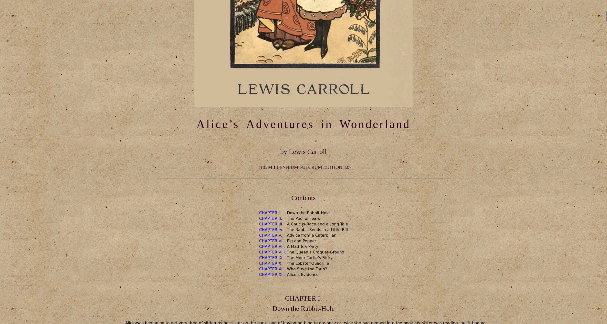
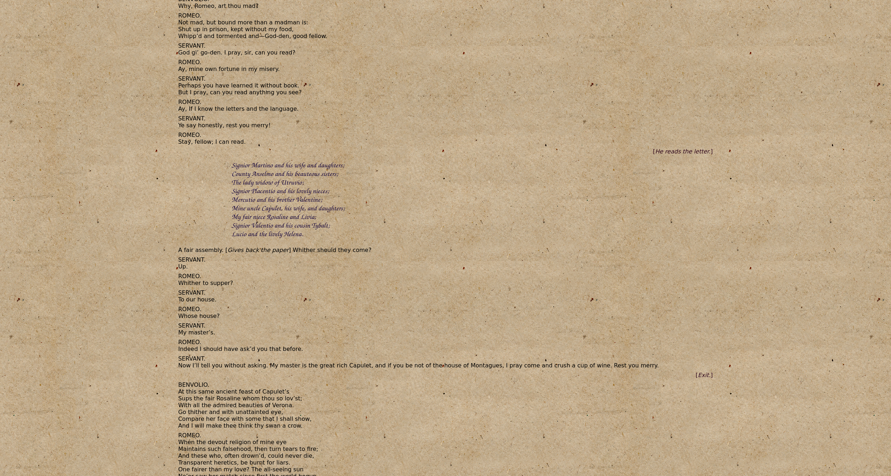

Assignment: CSS Hell
====================

## Author:  
Kyle Bricker

Part 1
======

### Changes to .html files:  

- Alice-in-Wonderland.html:  
  insert on line 65:  
  < link rel="stylesheet" type="text/css" href="style.css">
- Moby-Dick.html:  
  insert on line 30:  
  < link rel="stylesheet" type="text/css" href="style.css">
- Romeo-and-Juliet.html:
  insert on line 54:  
  < link rel="stylesheet" type="text/css" href="style.css">  

### Images:

Alice in Wonderland:

Moby Dick:

Romeo and Juliet:

Part 2
======

References:
===========
Background image for part 1:  
https://www.textures4photoshop.com/tex/paper/seamless-texture-rough-paper-free.aspx

License/Copyright
=================

Textual content is copyright Abram Hindle (C) 2013 under the CC-BY-SA
4.0 unported license. Attribution should be a hyperlink to the
repository and (C) 2013 Abram Hindle visibile in the text.

Code is licensed under the Apache 2.0 license.

